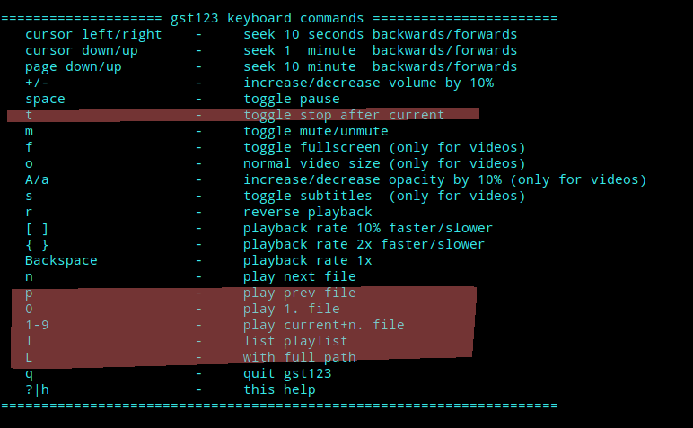

[![Test Build][testing-badge]][testing-url]
[![Version][version-badge]][version-url]

gst123
======

gst123 is a command line media player for linux/unix, implemented in C++.
It is distributed under the [LGPL2 or later](https://github.com/swesterfeld/gst123/blob/master/COPYING) license.

# DESCRIPTION

The program gst123 is designed to be a more flexible command line player
in the spirit of ogg123 and mpg123, based on gstreamer. It plays all file
formats gstreamer supports, so if you have a music collection which
contains different file formats, like flac, ogg and mp3, you can use gst123
to play all your music files.

All video file formats gstreamer can play are also available.

* For a full description, visit the project page:
	http://space.twc.de/~stefan/gst123.php

* To submit bug reports and feature requests, visit:
	https://github.com/swesterfeld/gst123/issues

# REQUIREMENTS

You need a C++ compiler, gstreamer-0.10 or gstreamer-1.0, gtk3.0 and ncurses to
build gst123.

# INSTALLATION

In short, gst123 needs to be built and installed with:

	./configure
	make
	make install

[testing-badge]: https://img.shields.io/github/actions/workflow/status/swesterfeld/gst123/testing.yml?style=for-the-badge
[testing-url]: https://github.com/swesterfeld/gst123/actions/workflows/testing.yml
[version-badge]: https://img.shields.io/github/v/release/swesterfeld/gst123?label=version&style=for-the-badge
[version-url]: https://github.com/swesterfeld/gst123/releases

-----

# FORK

I added some often used features.

  

